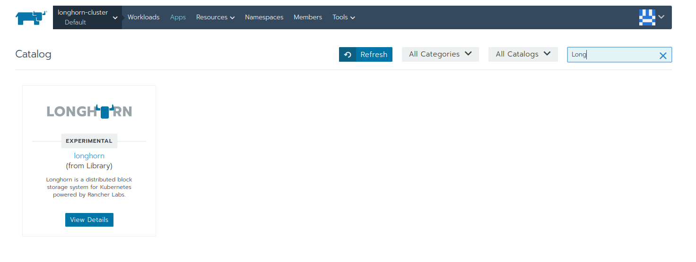
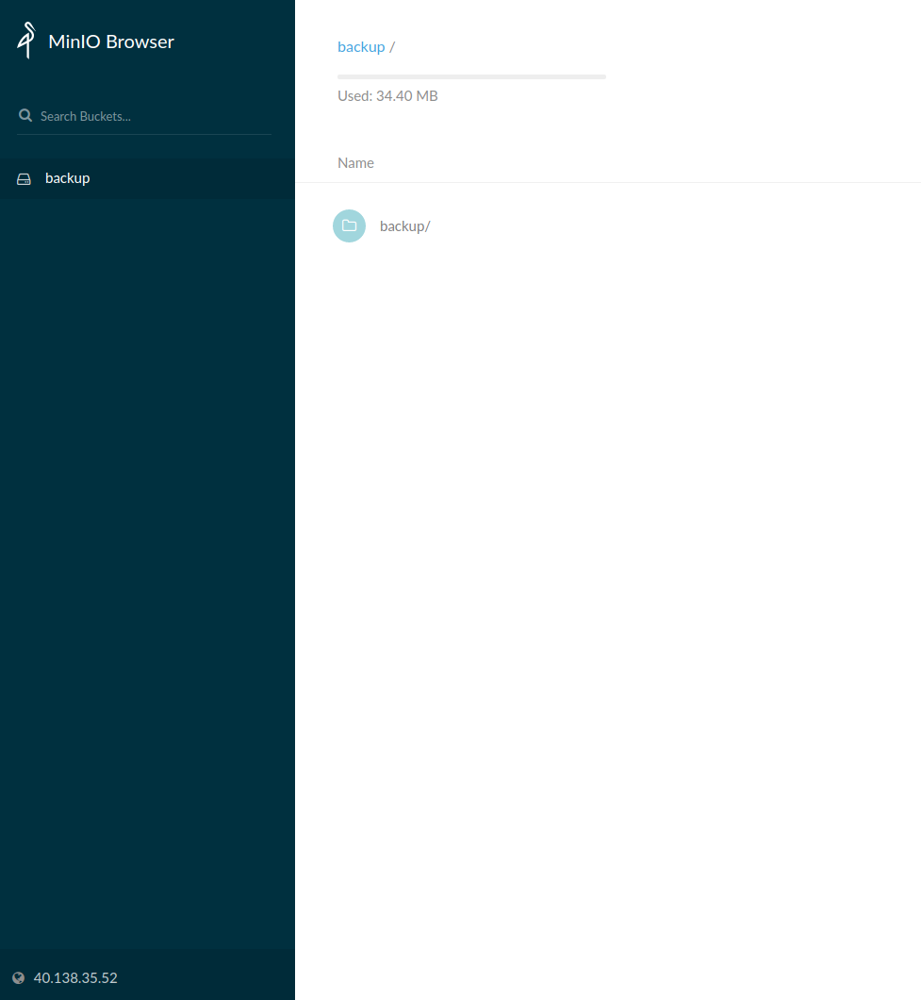
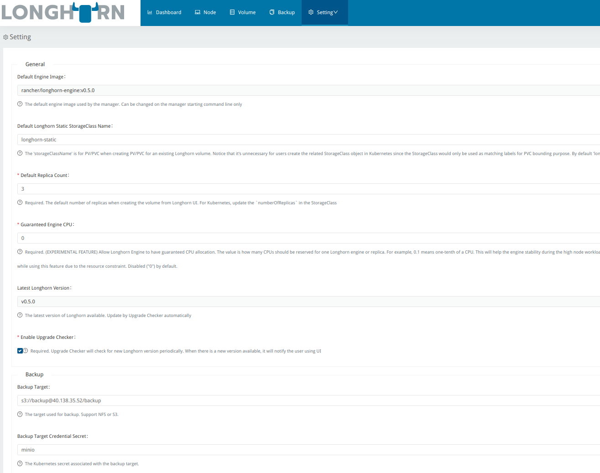
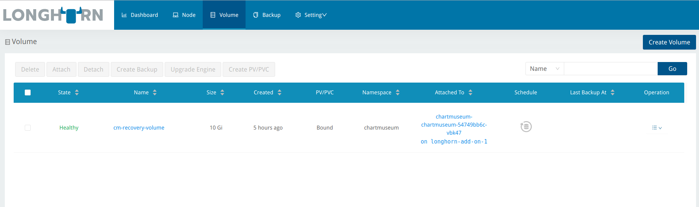
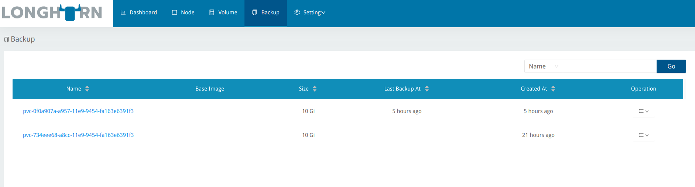

# Rancher Longhorn Notes


## Outline

+ Overview
+ Install Longhorn in Rancher
+ Using Minio for Backups
+ Setting up Longhorn to use Minio for Backups
+ Taking a Backup of a PVC
+ Restoring a PVC

### Overview

I started using Longhorn as a Persistent Storage Class in Kubernetes.
There were a few things I really liked about it:

+ Easy to set up
+ Supports backups and recovery of a Kubernetes PVC

### Install Longhorn in Rancher

Installing Longhorn in a Rancher Kubernetes cluster is easy.  You can
install it from Rancher's App Catalog.  Once Longhorn is installed you 
can use it as a Storage Class for your PVCs.




### Using Minio for Backups

I set up Minio for storing PVC backups `offsite`.  Minio uses the 
Amazon S3 protocol.  I created a bucket in Minio called `backup`.  Longhorn
will be set up to send backups to it.



### Setting up Longhorn to use Minio for Backups

#### Secret

Longhorn will need a Kubernetes Secret in the longhorn namespace to 
authenticate with Minio. This was tricky to set up because the values
needed to work weren't so intuitive.

```
apiVersion: v1
data:
  AWS_ACCESS_KEY_ID: QUtJQUlPU0ZPRE5ON0VYQU1QTEU= #this is base64 coded
  AWS_ENDPOINTS: aHR0cDovLzQwLjEzOC4zNS41Mg== #this is a base64 encoded URL http://40.138.35.52
  AWS_SECRET_ACCESS_KEY: d0phbHJYVXRuRkVNSS9LN01ERU5HL2JQeFJmaUNZRVhBTVBMRUtFWQ== #this is base64 coded
kind: Secret
metadata:
  name: minio
  namespace: longhorn-system
type: Opaque


```

#### Longhorn Config




### Taking a Backup of a PVC

After Longhorn is configured to point to Minio you can take a backup from the Volume page.




### Restoring a PVC

The PVCs can be restored from the Backup age.



The restore process is not very intuitive.  These are the steps I went through
to restore a PVC.

1. `Delete` the app (Chartmuseum in this case) to simulate a failure.
2. `Create` a `Disaster Recovery Volume` from the Backup page.
3. `Activate` the `Disaster Recovery Volume` from the Volumes page.
4. Create a `PV/PVC` from the Volumes page.
5. `DO NOT` attach the new PV/PVC from the Volumes page (this happens automatically in the next step). 
6. Reinstall the app you deleted from step 1. and select the PV/PVC created from step 4.  
7. The data should be restored at this point.
 
